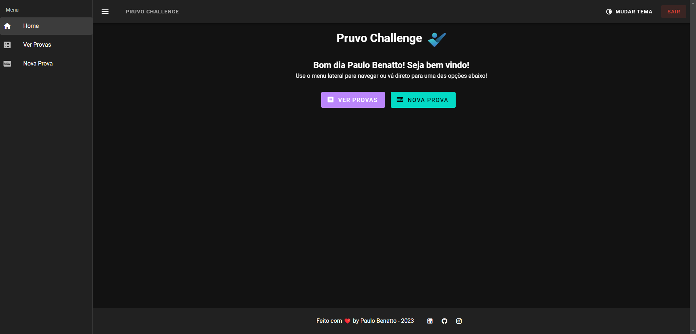

# ❤ Pruvo-Challenge

Aplicação Web para cadastro e edição de provas com integração ao Firebase totalmente responsiva.

[Clique aqui para acessar](https://pruvo-challenge.web.app/)

O aplicativo possui rotas protegidas que só podem ser acessadas após autenticação, os dados são persistidos no Firebase Firestore e atualizados em tempo real atráves de uma função de callback acionada pelo próprio Firebase ao detectar uma alteração na base de dados.

O usuário pode facilmente criar, visualizar, editar e deletar uma prova atráves da interface desenvolvida usando recursos de reatividade para deixar a interação mais fluída.

Há a opção de alterar o tema da aplicação entre tema claro e escuro a qualquer momento através da barra de navegação.

O login é persistido durante sessões, portanto na maioria das vezes não será necessário fazer login novamente.

Para edição do conteúdo de uma prova o aplicativo faz uso de um editor chamado [TinyMCE](https://www.tiny.cloud/tinymce/), esse editor permite a criação de textos ricos usando recursos do html de forma fácil e rápida. Ao lado do editor teremos 3 botões que permite a inserção de templates para questões, sendo elas:

- Discursivas
- Múltipla Escolha
- Matriz

_São apenas templates, podem e devem ser modificados_

A aplicação pode ser executada em ambiente de desenvolvimento usando o comando `npm run dev` após instalar as dependências do Node.js usando `npm install`. Mas há variavéis de ambiente para acesso ao Firebase e ao TinyMCE que não fazem parte do código fonte, portanto não estão disponíveis no repositório.

## ❔ Curiosidades

### Rotas

* / - Home
* /new - Criar nova prova (requer login)
* /tests - Listar provas criadas (requer login)
* /test/:id - Visualizar prova criada (requer login)
* /login - Realizar autenticação

Qualquer outra rota acessada é redirecionada para uma página de erro personalizada :)

---

### Estrutura dos dados no Firestore

- users (collection)
  - [USER_ID] (document)
    - tests (subcollection)
      - [TEST_ID] (document)
        - name: string
        - content: string
        - createdAt: timestamp
        - updatedAt: timestamp

### Gerenciamento de estado

A biblioteca oficial para gerenciamento de estados no Vue.js chamada Pinia tem função primordial na reatividade e comunicação de estados entre componentes, principalmente no compartilhamento do estado da autenticação e dos dados das provas do usuário logado, dessa forma reduzindo bastante tempo com requisições desnecessárias para o banco de dados e garantindo a velocidade na resposta do usuário.

## 🛠 Tecnologias

- TypeScript
- Vue.js
- Vuetify
- Pinia
- Firebase
- TinyMCE
- HTML
- CSS
